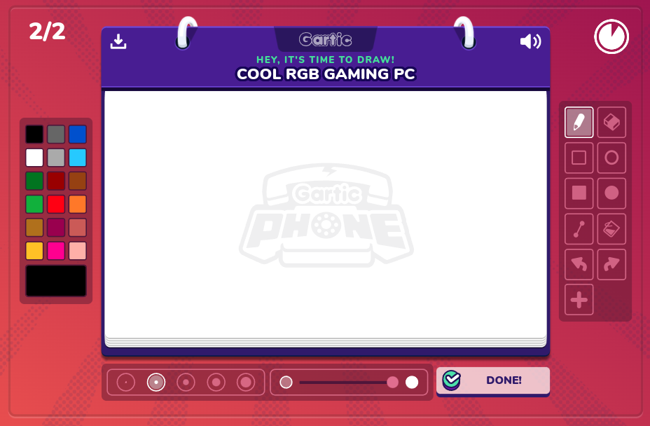
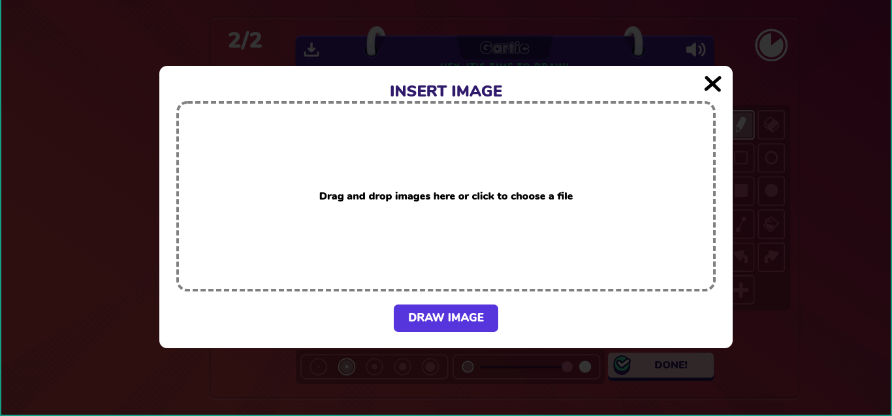
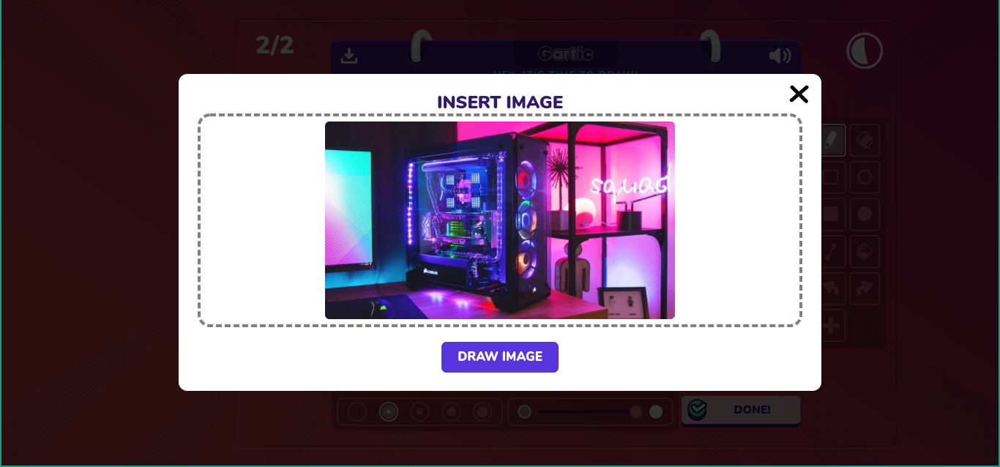
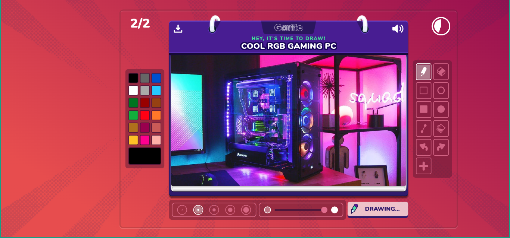
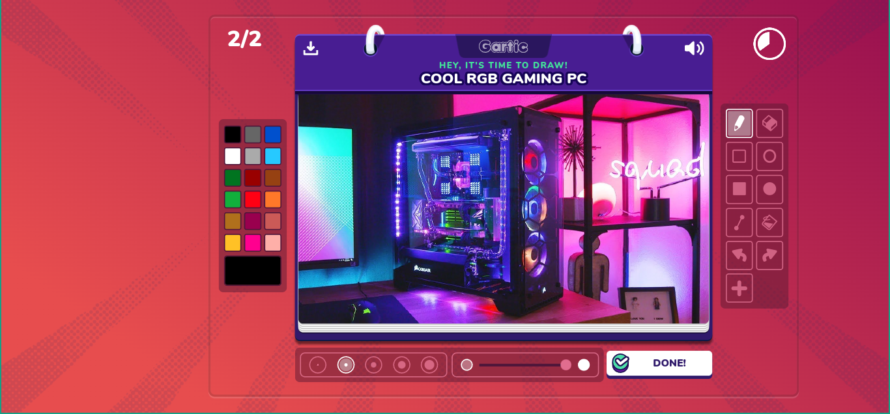
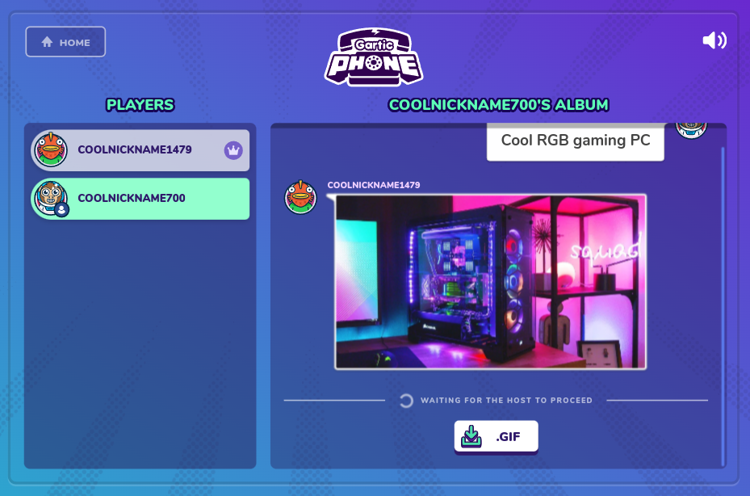

## What is this?

This is the **BEST** auto-draw script for Gartic Phone.

## How to install?

Paste the contents of `autodraw.min.js` into Tampermonkey or any other user script manager.

## Screenshots

The script adds an extra "+" button in the tools section. Clicking it opens the "Insert Image" menu.

The menu allows you to select an image file or drag and drop an image from the Web.

The "Done" button changes to "Drawing..." until all the image data is uploaded to the Gartic Phone servers. This may take a few moments depending on how detailed the image is.

When all the data is uploaded, the button changes back to "Done" and you can draw on top of the image.

Surprise your friends with this **amazing** hack!

